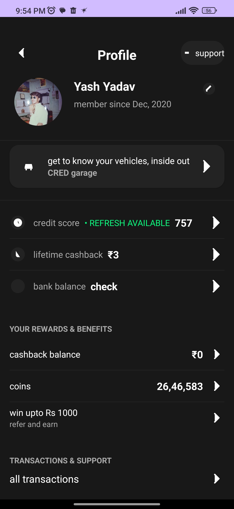

# Assignment

## Overview

This project is a pixel-perfect implementation of a profile screen inspired by the CRED app's UI design. The application features a sleek dark-themed interface with interactive elements and focuses on providing a premium user experience.

## Features

- **Modern Dark Theme UI**: Elegant black background with carefully chosen typography and spacing
- **Interactive Profile Management**:
  - Edit profile name functionality
  - Profile picture upload and change capability
- **Comprehensive Profile Sections**:
  - User information display
  - Vehicle information through CRED garage
  - Financial metrics (credit score, lifetime cashback)
  - Bank account integration
  - Rewards and benefits overview
  - Transaction history access

## Screenshots

## Implementation Details

### Profile Editing Functionality

The app implements two key interactive features:

1. **Name Editing**:
   - Tapping the pencil icon next to the user's name opens an edit dialog
   - Input validation ensures proper name formatting
   - Real-time updates to the UI upon confirmation

2. **Profile Picture Management**:
   - Tapping the profile image allows users to select a new photo
   - Options for camera capture or gallery selection
   - Image cropping and optimization for proper display

### UI Components

The interface includes carefully crafted components:
- Custom navigation bar with back button and support access
- Profile information section with editable fields
- Financial information cards with appropriate iconography
- List items with consistent styling and navigation indicators

## Technical Stack

- **Language**: Kotlin
- **Architecture**: MVVM
- **UI Components**: Material Design components with custom styling
- **Image Loading**: Glide library for efficient image handling
- **Animation**: Custom transitions for smooth user experience

## Getting Started

### Prerequisites
- Android Studio Arctic Fox (2020.3.1) or newer
- Minimum SDK: API 23 (Android 6.0)
- Target SDK: API 33 (Android 13)

### Installation
1. Clone this repository: git clone (https://github.com/yashrao2607/Assignment.git)
2. Open the project in Android Studio
3. Sync Gradle and run the application on an emulator or physical device

## Future Enhancements

- Implement remaining clickable sections with appropriate screens
- Add animations for smoother transitions between screens
- Integrate with a mock backend for data persistence
- Implement dark/light theme toggle

## License

This project is licensed under the MIT License - see the [LICENSE](LICENSE) file for details.

## Acknowledgements

- Design inspiration: CRED app
- Icons from Material Design and custom assets

